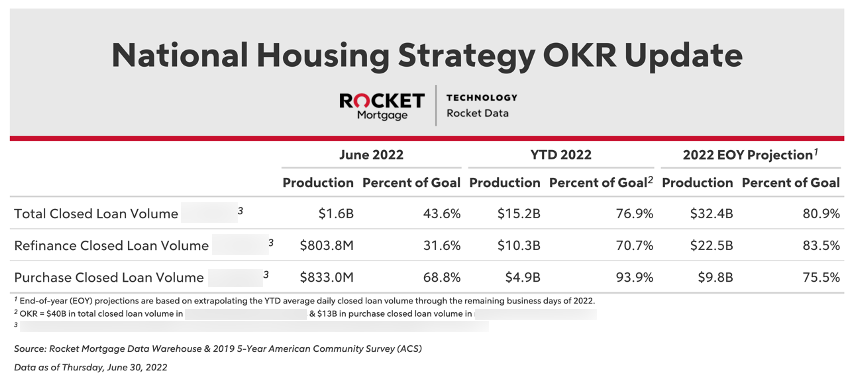
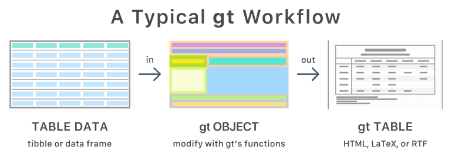
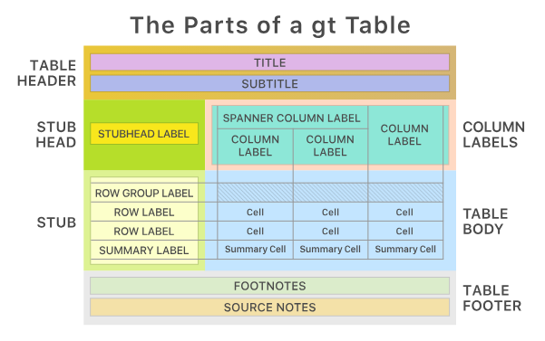

# Introduction to the `gt` package: Easily Create Presentation-Ready Display Tables

In this session, I'd like to highlight some of the functionality of the `gt` package. This package makes it easily to create great looking tables to help display your data/findings.

```{r setup}
knitr::opts_chunk$set(cache = TRUE, warning = FALSE, message = FALSE, 
                      echo = TRUE, dpi = 1000, cache.lazy = FALSE,
                      tidy = "styler", fig.width = 9, fig.height = 5)

# load libraries
library(tidymodels)     # the g.o.a.t. (for modeling)
library(tidytuesdayR)   # 
library(gt)             # creating publication-worthy tables
library(gtExtras)       # additional helper functions for gt
library(glue)           # interpreting R code in strings
library(here)           # for file navigation
```

## Examples of What You Can Do With `gt`

Here are a few examples of gt tables that I have made when reporting on various initiatives at Rocket Mortgage (sensitive information has been blurred for privacy reasons).




## [Sidecar 🚗] TidyTuesday: An Amazing Source for Datasets

TidyTuesday is a weekly data project in R, borne out of the R for Data Science (R4DS) textbook & online learning community. Every week the team posts a raw dataset and invites the community to explore the data. The goal of `TidyTuesday` is to apply your R skills, get feedback, explore others' work, and connect with the greater `#RStats` community!

I cannot more highly recommend taking a peek at the [GitHub repository](https://github.com/rfordatascience/tidytuesday) for this project and playing around with them.

For this session, we'll be uses the [Holiday Movies dataset](https://github.com/rfordatascience/tidytuesday/blob/master/data/2023/2023-12-12/readme.md) from the TidyTuesday project (from the week of December 12th, 2023).

```{r}
# Load the groundhogs datasets
tuesdata <- tidytuesdayR::tt_load("2024-01-30")
groundhogs <- tuesdata$groundhogs
predictions <- tuesdata$predictions

# Here's another way to load the datasets
# (I use this method since my Github enterprise saved credentials cause an issue)
groundhogs <- readr::read_csv('https://raw.githubusercontent.com/rfordatascience/tidytuesday/master/data/2024/2024-01-30/groundhogs.csv')
predictions <- readr::read_csv('https://raw.githubusercontent.com/rfordatascience/tidytuesday/master/data/2024/2024-01-30/predictions.csv')
```

## Preliminary Work: Creating A Compelling Data Summary

Let's take a look at the dataset:

```{r glimpse_the_datasets}
glimpse(groundhogs)
glimpse(predictions)
```

Based on these datasets, I'd like to compare the most common predictions for each groundhog in their first and last 10 years of predictions. E.g. Are groundhogs changing their minds about when spring will come?

```{r}
early_predictions <- predictions %>% 
  filter(!is.na(shadow)) %>% 
  group_by(id) %>%
  slice_min(order_by = year, n = 10, with_ties = FALSE) %>% 
  count(shadow) %>% 
  mutate(percentage = n / sum(n)) %>% 
  mutate(interpretation = case_when(shadow == TRUE ~ "winter",
                                    shadow == FALSE ~ "spring",
                                    .default = "unknown")) %>% 
  slice_max(order_by = percentage, n = 1, with_ties = FALSE) %>% 
  select(id, interpretation, percentage) %>% 
  rename(early_interpretation = interpretation,
         early_percentage = percentage) %>% 
  ungroup()

recent_predictions <- predictions %>% 
  filter(!is.na(shadow)) %>% 
  group_by(id) %>%
  slice_min(order_by = year, n = 10, with_ties = FALSE) %>% 
  count(shadow) %>% 
  mutate(percentage = n / sum(n)) %>% 
  mutate(interpretation = case_when(shadow == TRUE ~ "winter",
                                    shadow == FALSE ~ "spring",
                                    .default = "unknown")) %>% 
  slice_max(order_by = percentage, n = 1, with_ties = FALSE) %>% 
  select(id, interpretation, percentage) %>% 
  rename(recent_interpretation = interpretation,
         recent_percentage = percentage) %>% 
  ungroup()

most_predictions <- groundhogs %>% 
  left_join(early_predictions, by = join_by(id)) %>%
  left_join(recent_predictions, by = join_by(id)) %>% 
  group_by(country) %>% 
  slice_max(order_by = predictions_count, n = 10, with_ties = FALSE) %>% 
  select(country, name, ends_with("interpretation"), ends_with("percentage"))
```

## A Mini-Introduction to the `gt` Anatomy

Tables made with gt begin where all data pursuits do: which a table of data, either a tibble or a dataframe. You then decide how to compose your **gt table** with the elements and formatting you need for the task at hand. Finally, the table is rendered by printing it at the console, including it in an R Markdown document, or exporting to a file using [`gtsave()`](https://gt.rstudio.com/reference/gtsave.html). Currently, **gt** supports the **HTML**, **LaTeX**, and **RTF** output formats.



Like `ggplot2`, `gt` tables are consturcted using specific "geometries". Here's a diagram to map them:

{width="750"}

## Creating a Basic gt Table

```{r}
base_table <- most_predictions %>% 
  gt()

base_table
```

### Table Header

```{r}
table_with_header <- base_table %>% 
  tab_header(title = "North American Groundhogs")
table_with_header
```

### Table Footer

```{r}
table_with_header %>% 
  tab_source_note(source_note = "Source: Groundhog Day Predictions from groundhog-day.com")

table_with_sn <- table_with_header %>% 
  tab_source_note(
    source_note = md(glue("*Source: Internet Movie Database via TidyTuesday project*"))
  )
 
table_with_sn
```

### The Stub

Because we are feeding a grouped dataset into gt, it has already created row group headers for us.

If you dataset is no grouped and you want to create row groups, pipe in the bottom row group first and then the next one up.

```{r}
table_with_sn %>% 
  tab_row_group(label = "USA",
                rows = 11:20) %>% 
  tab_row_group(label = "Canada",
                rows = 1:10)

```

### The Column Labels

I often use spanner column labels to add "battleship coordinates" to my tables (this makes it easier to point out specific cells/rows/columns in conversations with my business partners"). Here's how I add the column spanner labels for that:

```{r}
table_with_sn %>% 
  tab_spanner(label = "A",
              columns = 1,
              id = "battleship_a") %>% 
  tab_spanner(label = "B",
              columns = 2,
              id = "battleship_b") %>% 
  tab_spanner(label = "C",
              columns = 3,
              id = "battleship_c") %>% 
  tab_spanner(label = "D",
              columns = 4,
              id = "battleship_d") %>% 
  tab_spanner(label = "E",
              columns = 5,
              id = "battleship_e") %>% 
  tab_spanner(label = "F",
              columns = 6,
              id = "battleship_f") #%>% 
  tab_spanner(label = "G",
              columns = 9,
              id = "battleship_g") %>% 
  tab_spanner(label = "H",
              columns = 10,
              id = "battleship_h") %>% 
 
```

### Bonus: Customizing the Table's Options

You can customize the heck out of gt tables for a beautiful, polished end-product for reporting. Let's use the holiday movies dataset to show an example of this.

```{r load_holiday_movies_data}
# Load the holiday movies dataset
tuesdata <- tidytuesdayR::tt_load('2023-12-12')
holiday_movies <- tuesdata$holiday_movies

# Here's another way to load the dataset
holiday_movies <- readr::read_csv('https://raw.githubusercontent.com/rfordatascience/tidytuesday/master/data/2023/2023-12-12/holiday_movies.csv')
```

```{r create_summarized_holiday_movies_data}
movie_summary <- holiday_movies %>% 
  separate_longer_delim(cols = genres,
                        delim = ",") %>% 
  rename(generic_holiday = holiday) %>% 
  pivot_longer(cols = c(christmas:generic_holiday),
               names_to = "holiday_movie_type",
               values_to = "flag") %>% 
  filter(flag == TRUE,
         !is.na(genres),
         holiday_movie_type %in% c("generic_holiday", "christmas"),
         title_type != "video") %>% 
  summarise(number_of_movies = n(),
            avg_run_time = mean(runtime_minutes, na.rm = TRUE),
            oldest_movie = min(year, na.rm = TRUE),
            median_rating = median(average_rating, na.rm = TRUE),
            .by = c(title_type, genres, holiday_movie_type)) %>% 
  group_by(title_type) %>% 
  # slice_max(order_by = number_of_movies, n = 10) %>%
  ungroup() %>% 
  pivot_wider(names_from = holiday_movie_type,
              values_from = number_of_movies:median_rating) %>% 
  arrange(title_type) %>% 
  select(title_type, genres, ends_with("holiday"), ends_with("christmas")) %>% 
  mutate(row = row_number(),
         .before = everything())
```

I'm also going to use a fun color palette for my final table, which we'll call Vintage Christmas[^1], plus a fun image[^2].

[^1]: Source: <https://colorpalettes.io/vintage-christmas-color-palette/>

[^2]: Source: <https://www.google.com/url?sa=i&url=https%3A%2F%2Fwww.freepik.com%2Fpremium-vector%2Fpicturesque-winter-landscape-with-cozy-houses-christmas-tree-mountain-snow-concept-happy-new-year-merry-christmas-vector-illustration_44662091.htm&psig=AOvVaw1fgClVijJVDb3YQTmGAKGb&ust=1705099086025000&source=images&cd=vfe&opi=89978449&ved=0CBUQjhxqFwoTCICJnZ6z1oMDFQAAAAAdAAAAABAI>

-   Autumn Bark -- Hex: 9D6E46

-   Green Essence -- Hex: E9EAC8

-   Milly Green -- Hex: 9ABB91

-   Clover Patch -- Hex: 4B9560

-   Red Alert -- Hex: BE3A34

-   Shiraz -- Hex: 862633


```{r establish color palette}
vintage_christmas <- c(
  "Autumn Bark" = "#9D6E46",
  "Green Essence" = "#E9EAC8",
  "Milly Green" = "#9ABB91",
  "Clover Patch" = "#4B9560",
  "Red Alert" = "#BE3A34",
  "Shiraz" = "#862633"
  )
```

[{width="694"}](https://www.google.com/url?sa=i&url=https%3A%2F%2Fwww.freepik.com%2Fpremium-vector%2Fpicturesque-winter-landscape-with-cozy-houses-christmas-tree-mountain-snow-concept-happy-new-year-merry-christmas-vector-illustration_44662091.htm&psig=AOvVaw1fgClVijJVDb3YQTmGAKGb&ust=1705099086025000&source=images&cd=vfe&opi=89978449&ved=0CBUQjhxqFwoTCICJnZ6z1oMDFQAAAAAdAAAAABAI)

```{r}
movie_summary <- holiday_movies %>% 
  separate_longer_delim(cols = genres,
                        delim = ",") %>% 
  rename(generic_holiday = holiday) %>% 
  pivot_longer(cols = c(christmas:generic_holiday),
               names_to = "holiday_movie_type",
               values_to = "flag") %>% 
  filter(flag == TRUE,
         !is.na(genres),
         holiday_movie_type %in% c("generic_holiday", "christmas"),
         title_type != "video") %>% 
  summarise(number_of_movies = n(),
            avg_run_time = mean(runtime_minutes, na.rm = TRUE),
            oldest_movie = min(year, na.rm = TRUE),
            median_rating = median(average_rating, na.rm = TRUE),
            .by = c(title_type, genres, holiday_movie_type)) %>% 
  group_by(title_type) %>% 
  # slice_max(order_by = number_of_movies, n = 10) %>%
  ungroup() %>% 
  pivot_wider(names_from = holiday_movie_type,
              values_from = number_of_movies:median_rating) %>% 
  arrange(title_type) %>% 
  select(title_type, genres, ends_with("holiday"), ends_with("christmas")) %>% 
  mutate(row = row_number(),
         .before = everything())
```

```{r}
movie_summary %>% 
  gt() %>% 
  tab_header(title = html('<p style="font-family:Cartoon Blocks Christmas; font-size:60px">Generic Holiday vs. Christmas Movies Comparison</p>'),
             subtitle = html(local_image(filename = here("ann_arbor_r_users_talk/idyllic_village.png"),
                                height = 400))
  ) %>% 
  tab_row_group(label = "TV Movie",
                rows = 23:44) %>% 
  tab_row_group(label = "Movie",
                rows = 1:22) %>% 
  gt_add_divider(columns = median_rating_generic_holiday,
                 color = vintage_christmas["Autumn Bark"][[1]],
                 weight = px(3)) %>% 
  tab_spanner(label = "Generic Holiday",
              columns = 3:6) %>% 
  tab_spanner(label = "Christmas",
              columns = 7:10) %>% 
  tab_spanner(label = "A",
              columns = 3,
              id = "battleship_a") %>% 
  tab_spanner(label = "B",
              columns = 4,
              id = "battleship_b") %>% 
  tab_spanner(label = "C",
              columns = 5,
              id = "battleship_c") %>% 
  tab_spanner(label = "D",
              columns = 6,
              id = "battleship_d") %>% 
  tab_spanner(label = "E",
              columns = 7,
              id = "battleship_e") %>% 
  tab_spanner(label = "F",
              columns = 8,
              id = "battleship_f") %>% 
  tab_spanner(label = "G",
              columns = 9,
              id = "battleship_g") %>% 
  tab_spanner(label = "H",
              columns = 10,
              id = "battleship_h") %>% 
  cols_label(row = "",
             genres = "Genres",
             number_of_movies_generic_holiday = "Number",
             avg_run_time_generic_holiday = "Avg Run Time",
             oldest_movie_generic_holiday = "Oldest Movie",
             median_rating_generic_holiday = "Median Rating",
             number_of_movies_christmas = "Number",
             avg_run_time_christmas = "Avg Run Time",
             oldest_movie_christmas = "Oldest Movie",
             median_rating_christmas = "Median Rating"
             ) %>% 
  fmt_number(columns = c(4, 6, 8, 10),
             decimals = 1) %>% 
  sub_missing(missing_text = "-") %>% 
  tab_source_note(
    source_note = ""
  ) %>%
  tab_source_note(
    source_note = md(glue("*Source: Internet Movie Database via TidyTuesday project*"))
  ) %>%
  opt_table_font(font = "Marker Felt") %>%
  cols_align(align= "right",
             columns = c(3:10)) %>% 
  tab_style(style = cell_text(size = "smaller",
                              color = vintage_christmas["Shiraz"][[1]]),
            locations = cells_body(columns = 1)) %>% 
  tab_style(style = cell_text(size = "smaller",
                              color = vintage_christmas["Shiraz"][[1]]),
            locations = cells_column_spanners(spanners = starts_with("battleship"))) %>% 
  opt_horizontal_padding(scale = 2) %>% 
  tab_options(table.border.top.color = "black",
              table.border.bottom.color = "black",
              table.border.right.color = "black",
              table.border.left.color = "black",
              table.border.top.width = 2,
              table.border.bottom.width = 2,
              table.border.right.width = 2,
              table.border.left.width = 2,
              heading.background.color = vintage_christmas["Clover Patch"][[1]],
              heading.border.bottom.color = vintage_christmas["Red Alert"][[1]],
              heading.border.bottom.width = 8,
              heading.title.font.size = 15,
              heading.padding = -20,
              column_labels.font.weight = "bold",
              row_group.padding.horizontal = 30,
              row_group.background.color = vintage_christmas["Green Essence"][[1]],
              row_group.border.top.color = "black",
              row_group.border.bottom.color = "black",
              row_group.font.weight = "bold",
              row_group.font.size = "20px",
              footnotes.font.size = "12px",
              source_notes.font.size = "14px")
  
gtsave(success_metrics_summary_table,
       here("images/final_results/success_metrics_summary_table.png"),
       vwidth = 1600, vheight = 800, zoom = 5)
```
